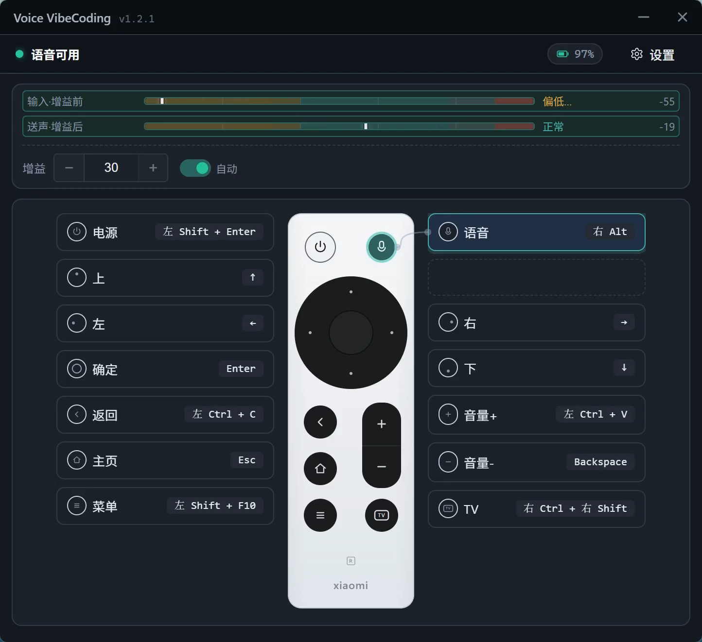

# Voice VibeCoding

把 **小米蓝牙遥控器 2 Pro** 接入 Windows，让它承担两件事：

- **按住语音键**：把小米蓝牙遥控器 2 Pro 的麦克风声音送入电脑，用于语音输入；
- **使用其他按键**：把按键发送为可配置的键盘按键或组合热键。

它把小米蓝牙遥控器 2 Pro 当作麦克风和键盘使用，专门解决 Windows 上“语音输入”和“遥控器热键”这两个具体问题。



> 这是实际使用中的主界面：上方显示输入音量、增益后音量和自动增益状态；下方显示小米蓝牙遥控器 2 Pro 的按键映射。语音卡片被选中时，表示当前正在使用语音键。

## 下载

从 [Releases](https://github.com/runningwaterpro/Voice_VibeCoding/releases/latest) 下载最新安装包。

当前项目适配目标是 **Windows 10/11 x64**。

## 首次使用

首次使用时，点击“一键修复”，按界面提示完成一次性准备：

1. 在Windows的蓝牙中先配对小米蓝牙遥控器 2 Pro；
2. 点击“一键修复”，按界面提示准备虚拟键盘和虚拟声卡；
3. 在输入法的设备列表中选择 CABLE Output，让遥控器输入的语音可以通过虚拟声卡传给输入法；
4. 按住小米蓝牙遥控器 2 Pro 的语音键，确认输入电平条有变化；
5. 把遥控器的某个按键映射为输入法的语音识别热键。

虚拟键盘和虚拟声卡正常情况下只需要首次安装。安装过程中如果需要管理员权限或重启系统，按界面提示完成即可。

软件不会修改 Windows 的默认麦克风。输入法的设备选择由用户自己完成。

## 日常使用

### 语音输入

按住小米蓝牙遥控器 2 Pro 的语音键说话，松开后结束本次语音输入。

### 键盘热键

在按键映射区选择一个小米蓝牙遥控器 2 Pro 按键，然后：

- 点击“录入”，直接按下想要绑定的按键或组合键；
- 或点击“手动组合”，手动选择按键。

映射完成后，小米蓝牙遥控器 2 Pro 的对应按键就会向当前前台程序发送对应热键。

## 语音输入与自动增益

麦克风距离嘴的远近，以及发音大小差异，可能导致小米蓝牙遥控器 2 Pro 的麦克风音量可能偏大或偏小。普通用户不需要理解 dB 数值，主要观察界面上的两条电平条：

- **输入·增益前**：小米蓝牙遥控器 2 Pro 实际收到的声音；
- **送声·增益后**：经过增益后、准备发送给输入法的声音。

让增以后的数值尽量落在电平条的绿色区域。自动增益会据此调整音量，降低声音过小或过大的风险。

新用户默认开启自动增益。系统会根据说话声音自动调整增益，让输入法接收到更适合识别的音量。需要手动调整时，可以使用界面上的增益控制；手动调节属于高级用法，不建议自己设置。

## 一键修复

使用过程中如果出现桥接断开、语音通道未连接、虚拟键盘未就绪或虚拟声卡异常，直接点击 **“一键修复”**。

软件会根据当前状态自动执行对应修复，不需要用户判断应该选择哪一项。需要管理员权限或重启时，界面会单独提示。

## 关于语音键的 F5 泄露

> 说明：小米蓝牙遥控器 2 Pro 的语音键可能产生固件原始 F5 泄露到前台程序。如果当前使用的应用程序会响应 F5，就可能受到干扰。

本项目不把这个问题交给用户通过输入法热键配置来规避，而是从按键拦截和虚拟键盘注入链路根部处理：尽量抑制固件原始信号，再发送真正需要的热键。

目前仍无法承诺百分之百不会泄露，但泄露概率已经很低，正常使用不受影响。用户不需要为了规避这个问题，在输入法里专门绑定包含 F5 的组合键。

## 与上游项目的差异

与上游项目相比，本项目聚焦以下使用目标：

| 项目 | 本项目的方向 |
| --- | --- |
| 目标设备 | 只针对小米蓝牙遥控器 2 Pro 进行适配和测试 |
| 语音方式 | 只保留按住说话，松开后结束语音会话 |
| 适用场景 | 面向 Windows 上的语音输入和遥控器热键 |
| 首次配置 | 通过引导完成虚拟键盘、虚拟声卡和输入法设备准备 |
| 音量判断 | 用输入/输出两条电平条直接显示声音状态 |
| 自动增益 | 新用户默认开启，用户无需理解参数 |
| 常见故障 | 统一使用“一键修复”，不要求用户选择修复项目 |
| 热键泄露 | 从按键链路根部降低 F5 泄露，不要求用户绑定特殊 F5 热键 |
| 系统麦克风 | 不修改 Windows 默认麦克风 |
| 其他设备 | 不以 T1/V60 等设备为目标 |

其他型号没有经过本项目测试。虽然协议可能相近，但不保证兼容。

## 使用边界

- 当前只对小米蓝牙遥控器 2 Pro 做过适配和实测；
- 软件运行在 Windows 上，不提供完整操作系统模拟；
- 语音键的固件原始 F5 泄露无法做到理论上的绝对为零；
- 输入法需要用户手动选择 CABLE Output；
- 虚拟键盘和虚拟声卡属于首次使用的环境准备，不需要用户自行构建。

## 开发

```bash
npm install
npm run dev          # 启动前端开发环境
npm run build        # 类型检查 + 前端构建
npm test             # 前端测试
npm run tauri:build  # 本地构建 Tauri 安装包
```

完整质量检查：

```bash
npm run check:ci
```

运行日志：

```text
%APPDATA%\com.remote-bridge-hub.app\logs\app.log
```

## 致谢与许可

- 上游项目：[mwlt/Voice_VibeCoding](https://github.com/mwlt/Voice_VibeCoding)
- 手动组合功能参考：[LightyearXizIl/Nexus-Prime](https://github.com/LightyearXizIl/Nexus-Prime)
- 上游代码与资源版权属于 mwlt 及其贡献者；本仓库修改遵循上游许可。
